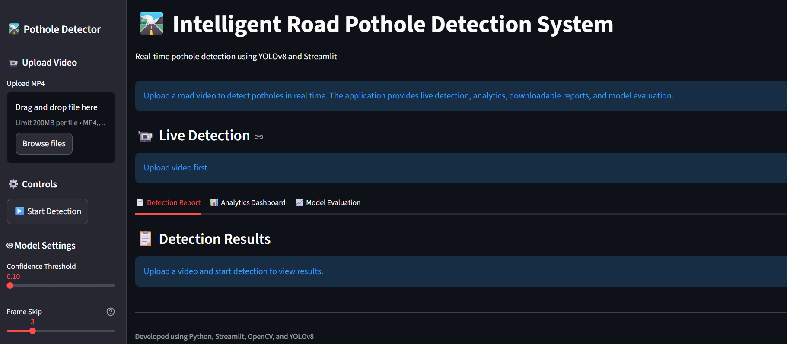
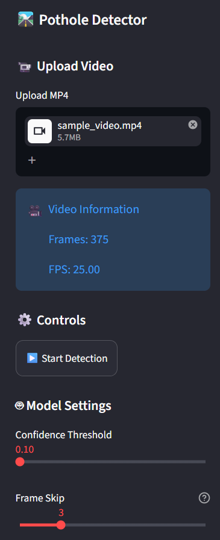
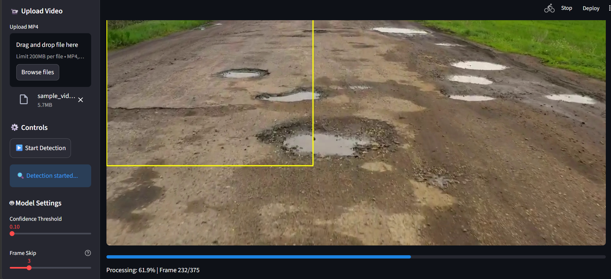
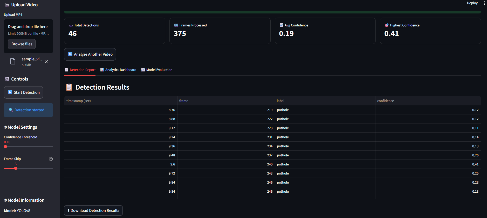
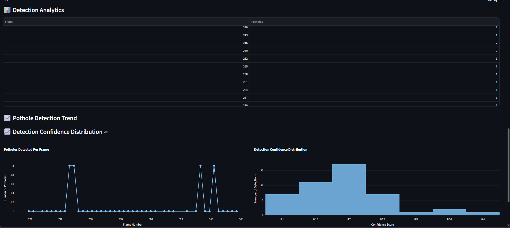
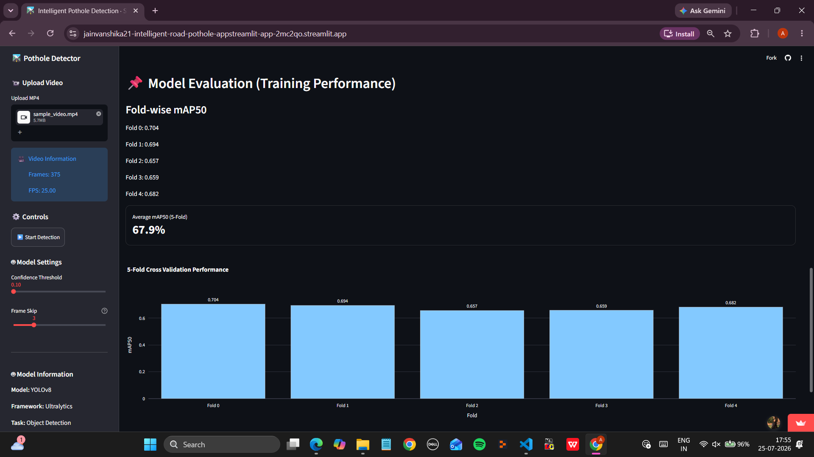

# 🛣️ Intelligent Road Pothole Detection System


> An end-to-end Computer Vision project for detecting road potholes from uploaded videos using YOLOv8, OpenCV, and Streamlit, with interactive analytics, detection reports, and model performance evaluation.

---

# 🌐 Live Demo

🚀 **[Open the Live Pothole Detection App](https://jainvanshika21-intelligent-road-pothole-appstreamlit-app-2mc2qo.streamlit.app/)**

The application is deployed using Streamlit and allows users to upload road videos, run pothole detection, view bounding-box predictions, explore interactive analytics, and download detection reports.

---

# 📌 Project Overview

The **Intelligent Road Pothole Detection System** is an AI-powered Computer Vision application designed to automatically detect potholes from road videos.

The system uses a custom-trained **YOLOv8 object detection model** to identify potholes in video frames. **OpenCV** is used for video processing, while **Streamlit** provides an interactive web-based interface for running detection and analyzing results.

The application provides visual detection results with bounding boxes, confidence scores, detection reports, interactive analytics, and model performance evaluation.

---

# ⭐ Project Highlights

* 🚀 AI-powered pothole detection using YOLOv8
* 🎥 Video-based pothole detection using OpenCV
* 📦 Bounding box visualization with confidence scores
* 📊 Interactive analytics dashboard
* 📄 Downloadable CSV detection reports
* 🎯 Adjustable confidence threshold
* 🧠 5-Fold Cross Validation for model evaluation
* 🌐 Deployed as a live Streamlit web application
* 💻 Interactive and user-friendly web interface

---

# 🎯 Project Objective

The objective of this project is to develop an automated system capable of identifying potholes from road videos using Computer Vision and Deep Learning.

The system aims to:

* Reduce the need for manual pothole inspection
* Automatically identify potholes in road footage
* Provide visual detection results
* Generate structured detection reports
* Analyze pothole detection patterns
* Evaluate model performance using validation techniques

---

# 🚀 Features

## 🎥 Video Processing

* Upload `.mp4` road videos
* Extract and process video frames using OpenCV
* Display detected potholes with bounding boxes
* Show confidence scores for detections

## 🤖 AI-Based Detection

* YOLOv8-based object detection
* Adjustable confidence threshold
* Automated pothole detection from video frames

## 📊 Interactive Analytics

* Total pothole detections
* Detection confidence distribution
* Frame-wise detection trends
* Detection report table
* Interactive visualizations

## 📄 Detection Reports

* Generate structured detection results
* Export detection data as CSV
* Download reports for further analysis

## 🧠 Model Evaluation

* 5-Fold Cross Validation
* Fold-wise mAP@50 performance
* Average mAP@50
* Performance comparison visualization

---

# 🧠 Model Details

The project uses a custom-trained **YOLOv8 object detection model** for pothole detection.

### Detection Class

* `Pothole`

### Model Output

For each detected pothole, the system provides:

* Bounding box visualization
* Detection label
* Confidence score
* Detection timestamp
* Video frame number

---

# 🤖 Model Evaluation

The project includes model evaluation using **5-Fold Cross Validation**.

The evaluation dashboard presents:

* Fold-wise mAP@50
* Average mAP@50
* Performance comparison across folds

The results are visualized using an interactive bar chart to compare model performance across individual folds.

---

# 🛠️ Tech Stack

| Category         | Technologies       |
| ---------------- | ------------------ |
| Programming      | Python             |
| Computer Vision  | OpenCV             |
| Deep Learning    | Ultralytics YOLOv8 |
| Web Framework    | Streamlit          |
| Data Analysis    | Pandas, NumPy      |
| Visualization    | Plotly, Matplotlib |
| Machine Learning | Scikit-learn       |

---

# 🎥 Demo Video

Click below to view the project demonstration:

▶️ **[Pothole Detection Demo](assets/Pothole_Detection_Demo.mp4)**

---

# 📂 Project Structure

```text
Intelligent-Road-Pothole-Detection/
│
├── app/
│   └── streamlit_app.py
│
├── src/
│   ├── config.py
│   ├── detector.py
│   ├── storage.py
│   └── video.py
│
├── scripts/
│
├── models/
│   └── pothole.pt
│
├── data/
│
├── runs/
│   └── detect/
│       └── kfold_results/
│
├── assets/
│   ├── 01_Home_Dashboard.png
│   ├── 02_Video_Upload.png
│   ├── 03_Live_Pothole_Detection.png
│   ├── 04_Detection_Report.png
│   ├── 05_Analytics_Dashboard.png
│   ├── 06_Model_Performance.png
│   └── Pothole_Detection_Demo.mp4
│
├── requirements.txt
├── README.md
└── .gitignore
```

---

# 🚀 Installation

## 1. Clone the Repository

```bash
git clone https://github.com/jainvanshika21/Intelligent-Road-Pothole-Detection.git
```

## 2. Move into the Project Directory

```bash
cd Intelligent-Road-Pothole-Detection
```

## 3. Install Dependencies

```bash
pip install -r requirements.txt
```

## 4. Launch the Application

```bash
streamlit run app/streamlit_app.py
```

---

# 🎥 How to Use

1. Open the deployed application or run it locally.
2. Upload a road video in `.mp4` format.
3. Adjust the confidence threshold.
4. Adjust the frame skip value if required.
5. Start the detection process.
6. View detected potholes with bounding boxes.
7. Review detection summary metrics.
8. Explore the Detection Report.
9. Explore the Analytics Dashboard.
10. Download detection results as a CSV file.
11. View model evaluation results.

---

# 🔄 System Workflow

```text
                 Road Video
                      │
                      ▼
                Upload Video
                      │
                      ▼
           Frame Extraction (OpenCV)
                      │
                      ▼
              YOLOv8 Detection
                      │
                      ▼
          Bounding Box Visualization
                      │
                      ▼
             Detection Results
                │           │
                │           │
                ▼           ▼
            Analytics    CSV Report
                │
                ▼
          Model Evaluation
```

---

# 📊 Analytics Dashboard

The application provides interactive analytics including:

* 📌 Total number of pothole detections
* 🎞️ Number of frames processed
* 📈 Average detection confidence
* 🎯 Highest detection confidence
* 📉 Frame-wise pothole detection trends
* 📊 Detection confidence distribution
* 📋 Detection results table
* 📄 Downloadable CSV report

These visualizations help analyze detection patterns and understand model predictions across the processed video.

---

# 📸 Application Preview

## 🏠 Home Dashboard



---

## 🎥 Video Upload



---

## 🚧 Live Pothole Detection



---

## 📋 Detection Report



---

## 📊 Analytics Dashboard



---

## 🤖 Model Performance



---

# 📦 Outputs

The system generates:

* ✅ Pothole detection results
* ✅ Bounding box visualizations
* ✅ Confidence scores
* ✅ Detection timestamps and frame numbers
* ✅ Detection summary metrics
* ✅ Downloadable CSV reports
* ✅ Interactive analytics
* ✅ Model evaluation results

---

# ⚠️ Limitations

* Detection performance depends on video quality and lighting conditions.
* Extremely blurry or low-resolution videos may reduce detection accuracy.
* The model may produce false positives on road surfaces with patterns similar to potholes.
* The current system focuses on pothole detection and does not classify pothole severity.
* GPS-based pothole location tracking is not currently implemented.
* The application is designed for uploaded road videos rather than continuous live camera feeds.

---

# 🔮 Future Enhancements

* 📍 GPS-based pothole mapping
* 🗺️ Interactive pothole mapping dashboard
* ☁️ Cloud deployment improvements
* 📱 Mobile application
* 🎥 Live camera-based detection
* 🚧 Pothole severity classification
* 🌍 Smart City infrastructure integration
* 📍 Automatic location tagging
* 📊 Historical pothole tracking

---

# 📚 Dependencies

```text
streamlit>=1.30
opencv-python-headless>=4.8
numpy>=1.24
pandas>=2.0
ultralytics>=8.0
scikit-learn>=1.3
matplotlib>=3.7
seaborn>=0.12
PyYAML>=6.0
plotly
```

Install all dependencies using:

```bash
pip install -r requirements.txt
```

---

# 👩‍💻 Author

## Vanshika Jain

**MCA Student | Computer Vision & Data Analytics Enthusiast**

* 🔗 [GitHub](https://github.com/jainvanshika21)
* 🔗 [LinkedIn](https://www.linkedin.com/in/vanshika-jain-17007128a/)

### Skills

`Python` • `YOLOv8` • `OpenCV` • `Streamlit` • `Computer Vision` • `Pandas` • `NumPy` • `Plotly` • `Scikit-learn` • `Machine Learning` • `Deep Learning`

---

# 🌟 Support

If you found this project useful, consider giving the repository a ⭐ on GitHub.
